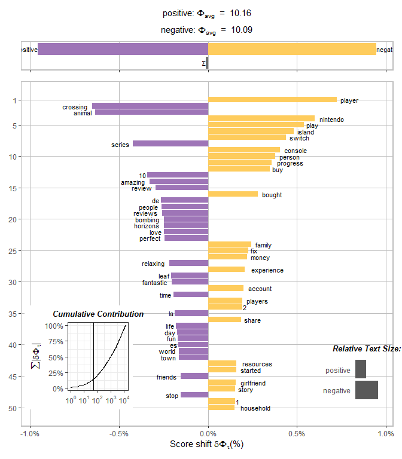

<!-- README.md is generated from README.Rmd. Please edit that file -->

# shifterator

<!-- badges: start -->

[](https://github.com/pverspeelt/shifterator/actions)

<!-- badges: end -->

The Shifterator package provides functionality for constructing word
shift graphs, vertical bart charts that quantify which words contribute
to a pairwise difference between two texts and how they contribute. By
allowing you to look at changes in how words are used, word shifts help
you to conduct analyses of sentiment, entropy, and divergence that are
fundamentally more interpretable.

## Installation

You can install the development version from
[GitHub](https://github.com/) with:

``` r
# install.packages("devtools")
devtools::install_github("pverspeelt/shifterator")
```

## Introduction to shifterator

**shifterator** is a port from the python shifterator package for
visualizing pairwise comparisons between texts. For detailed information
about the formulas used to calculate the shifts, you can have a look at
the [python
cookbook](https://shifterator.readthedocs.io/en/latest/cookbook/index.html).

I’m going to have a look at the Animal Crossing review dataset that was
used on a \#TidyTuesday episode by Julia Silge. Here is a
[link](https://juliasilge.com/blog/animal-crossing/) to the blog post.
This dataset will be used to give a quick overview of how to prepare
data to be used with the shifterator functions and how to plot the
outcome of the word shift graphs.

So let’s load the data and have a quick look at the grade distribution.

``` r
library(dplyr)
library(readr)
library(stringr)
library(tidytext)
library(ggplot2)
library(shifterator)

user_reviews <- read_tsv("https://raw.githubusercontent.com/rfordatascience/tidytuesday/master/data/2020/2020-05-05/user_reviews.tsv")

user_reviews %>%
  count(grade) %>%
  ggplot(aes(grade, n)) +
  geom_col(fill = "steelblue")
```


A quick look at the data shows that the data is concentrated on the
ends, 0 or 10. The mean grade is 4.22 and the median is 2. But let’s
take the same definition as used in the blog post, a score higher than
7is a good review and below a bad review. And using the same data
cleaning rule to get rid of the word “Expand” that appears at the end of
a lot of reviews.

``` r
negative_reviews <- user_reviews %>% 
  mutate(text = str_remove(text, "Expand$")) %>%
  filter(grade <= 7)

positive_reviews <- user_reviews %>% 
  mutate(text = str_remove(text, "Expand$")) %>%
  filter(grade > 7)
```

Now that the data is split, shifterator functions expects data to be in
two columns, words and their frequencies. You can build those in a lot
of different ways, but since I’m using data from a blog post of Julia
Silge, I will use tidytext to create word frequency tables.

``` r
cleaned_negative_reviews <- negative_reviews %>% 
  unnest_tokens(word, text) %>% 
  anti_join(stop_words) %>% 
  group_by(word) %>% 
  summarise(freq = n())

cleaned_positive_reviews = positive_reviews %>% 
  unnest_tokens(word, text) %>% 
  anti_join(stop_words) %>% 
  group_by(word) %>% 
  summarise(freq = n())
```

After the creation of the frequency tables, a quick look at the top 15
words that appear in the positive and negative reviews.

``` r
library(patchwork)  
p_neg <- cleaned_negative_reviews %>% 
  top_n(15) %>% 
  ggplot(aes(reorder(word, freq), y = freq)) +
  geom_bar(stat = "identity", fill = "darkred") + 
  labs(title = "Negative reviews", x = "words") +
  coord_flip()

p_pos <- cleaned_positive_reviews %>% 
  top_n(15) %>% 
  ggplot(aes(reorder(word, freq), y = freq)) +
  geom_bar(stat = "identity", fill = "darkgreen") + 
  labs(title = "Positive reviews", x = "words") +
  coord_flip()

p_neg + p_pos
```


Looking at the graphs, you can see that “*game*” and “*island*” are the
top words in both. The word “*fun*” and the number *10* in the positive
reviews is to be expected. But the top words in the negative reviews
leave a lot of guessing why they are there. This is where shifterator
comes into play. The calculations of the words between the texts and how
often they appear give a weight to them. The several word shift
calculations available in shifterator can help to distinguish which
words are more important in one text or in the other.

``` r
entropy <- entropy_shift(cleaned_positive_reviews, cleaned_negative_reviews)
get_shift_graphs(entropy, text_names = c("positive", "negative"))
```



The shift graph shows the words in a more interesting way. Now you can
see which words are more related to the positive (purple) side or to the
negative (yellow) side. The word “*player*” is now the top negative word
when comparing the positive versus the negative reviews. As you would
expect, the words “*amazing*”, “*fantastic*”, and “*10*” are positive,
and “*1*”, “*2*”, “*fix*” are negative. As to why Nintendo scores high
on the negative side, that might be interesting for someone to figure
out.

### Citation

Read the following paper for more details on word shifts, and please
cite it if you use them in your work:

(Gallagher et al. 2021)

<div id="refs" class="references csl-bib-body hanging-indent">

<div id="ref-Gallagher2021" class="csl-entry">

Gallagher, Ryan J., Morgan R. Frank, Lewis Mitchell, Aaron J. Schwartz,
Andrew J. Reagan, Christopher M. Danforth, and Peter Sheridan Dodds.
2021. “Generalized Word Shift Graphs: A Method for Visualizing and
Explaining Pairwise Comparisons Between Texts.” *EPJ Data Science* 10
(1): 4. <https://doi.org/10.1140/epjds/s13688-021-00260-3>.

</div>

</div>
